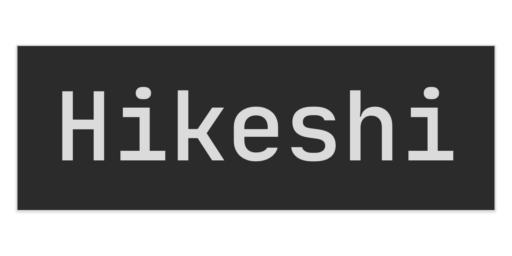

# Welcome

## Introduction

Hikeshi is a security incident response application that keeps documenting incidents simple, so you can focus on fighting fires.

### Why the name "Hikeshi"?

The name comes from the firefighting system established in Japan during the Edo period. Incident response involves a lot of "firefighting" in the sense that you're only called upon when something has gone very wrong. In high stress situations, it's nice to have a simple tool that assists you while you fight those fires.

### The Goal

The primary hope for this application is to create a tool that doesn't get in the way or add to the stress of incident response. It aims to be simple, reliable, and unobtrusive. 

#### TLDR

* No-cluttered UI.
* No noisey in-app notifications. 
* Web Hooks encourage you to integrate with slack.
* Dark mode support by default.
* Designed specifically for incident response.

It isn't feature packed, but it does exactly what it needs to while you take care of the incidents at hand.

