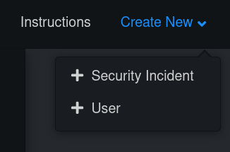
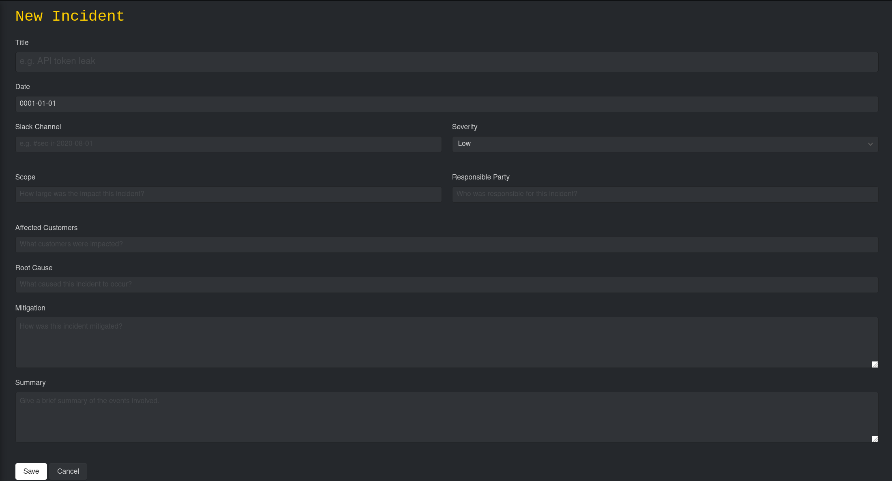
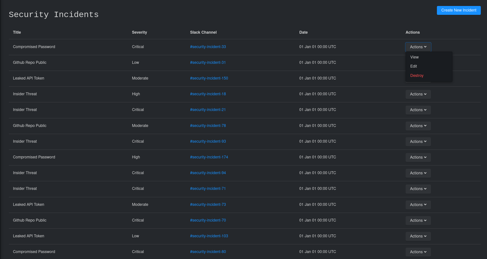
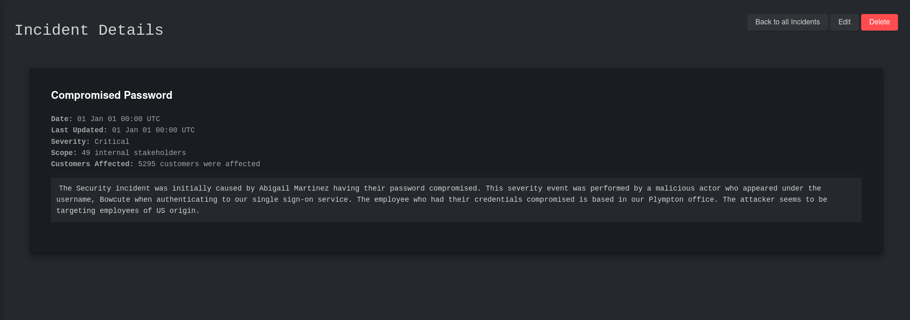

# New Incident

### 1. Create New &gt; Security Incident

The create new dropdown can be thought of as _home base._ Whenever you want to submit new information to hikeshi, this dropdown is your friend.

### 2. Fill out the incident form

The incident form contains fields based on user feedback from Security Incident Response professionals. Filling out every detail will allow you to reflect back on the incident with a comprehensive log of the events that occurred. Fill this form out to the best of your abilities. You'll thank yourself later for documenting the incident thoroughly.

Once you've wrapped up adding all the details of the incident, click the save button at the bottom.


If you feel that this form doesn't cover all the bases or is missing anything, please open a Github Feature Request Issue. Filling this form out should leave you feeling confident that the incident has been documented. If it doesn't do that, I haven't done my job right and I'd like to help make that better.


### 3. View your new incident

Now that you've saved and uploaded your incident to Hikeshi, let's click the **Security Incidents** link on the sidebar. This will take you to your list of submitted incidents.

There are a few actions you can take with an incident from this view. By clicking the **actions** dropdown, you can either view, edit, or delete the incident. 

Let's click view and see what we've submitted.

If you've done the following, you're all done!

* [x] Clicked the **Create New &gt; Security** Incident button
* [x] Navigated to your incidents list
* [x] Clicked the **Actions &gt; View** button for the incident you submitted
* [x] Viewed your new incident

